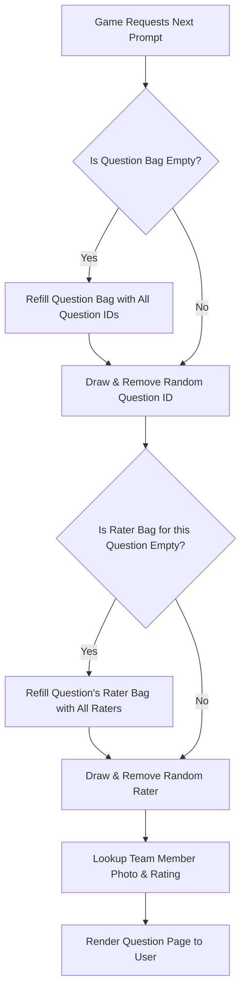

# They're a 10 But... 🎯

An interactive web-based rating and guessing game built with **React**, **Tailwind CSS**, and **DaisyUI**. Players are presented with hilarious "They're a 10 but..." scenarios and must guess how specific team members rated each trait on a scale from 1 to 10.

---

## 🚀 Features

* **Interactive Gameplay:** Simple, engaging 3-screen flow: *Start Screen*, *Question Screen*, and *Feedback Screen*.
* **DaisyUI Range Slider:** Smooth 1–10 slider for intuitive score guessing.
* **Dual "Bag of Marbles" Sampling:** Ensures zero repeat questions or raters until the entire pool has been exhausted.
* **Dynamic Team Roster:** Seamlessly maps photos and ratings to team members using flexible JSON schema structures.
* **Responsive Card UI:** Styled cleanly with Tailwind CSS and DaisyUI components.

---

## 🛠️ Tech Stack

* **Frontend Library:** React (Functional Components & Custom Hooks)
* **CSS Framework:** Tailwind CSS
* **UI Component Library:** DaisyUI
* **Data Interchange:** JSON (Strict JSON Schema validation compliant)

---

## 📂 Data Schemas

The application relies on two primary data structures:

### 1. Questions Schema (`questions.json`)
Contains the list of traits along with ratings provided by team members.

```json
{
  "$schema": "http://json-schema.org/draft-07/schema#",
  "title": "TheyreATenQuestions",
  "type": "object",
  "properties": {
    "questions": {
      "type": "array",
      "items": {
        "type": "object",
        "properties": {
          "id": { "type": "string" },
          "trait": { "type": "string" },
          "answers": {
            "type": "array",
            "items": {
              "type": "object",
              "properties": {
                "memberName": { "type": "string" },
                "rating": { "type": "integer", "minimum": 0, "maximum": 10 }
              },
              "required": ["memberName", "rating"]
            }
          }
        },
        "required": ["id", "trait", "answers"]
      }
    }
  },
  "required": ["questions"]
}
```

### 2. Team Members Schema (`teamMembers.json`)
Maps team member names to their photo filenames.

```json
{
  "$schema": "http://json-schema.org/draft-07/schema#",
  "title": "TeamMembers",
  "type": "object",
  "properties": {
    "teamMembers": {
      "type": "array",
      "items": {
        "type": "object",
        "properties": {
          "name": { "type": "string" },
          "image": { "type": "string" }
        },
        "required": ["name", "image"]
      }
    }
  },
  "required": ["teamMembers"]
}
```

---

## 🧠 Implementation Details

### Architecture & Component Structure

The app is built as a single-page React application structured around three primary views managed by a central state machine (`gameState`):

```
┌─────────────────┐     Start Game     ┌─────────────────┐
│   START_SCREEN  │ ─────────────────► │  QUESTION_PAGE  │
└─────────────────┘                    └─────────────────┘
         ▲                                      │
         │                                      │ Submit Guess
         │                                      ▼
         │      Play Next / Reset      ┌─────────────────┐
         └──────────────────────────── │ FEEDBACK_SCREEN │
                                       └─────────────────┘
```

---

## 🎲 The "Bag of Marbles" Sampling Algorithm

To avoid repetitive scenarios and ensure balanced presentation across all questions and team members, the application utilizes a **Dual Bag of Marbles Algorithm** (sampling without replacement).

### How It Works

1. **Global Question Bag (`questionBag`):**
   * Holds an array of unplayed question IDs (`['q1', 'q2', 'q3', ...]`).
   * When a question is requested, a random index is selected, drawn from the bag, and removed.
   * When the bag becomes empty, it automatically **refills and reshuffles** with all available question IDs.

2. **Per-Question Rater Bags (`raterBags` Map):**
   * Each question maintains its own independent pool of unplayed raters (`Map<questionId, memberName[] >`).
   * Once a question is picked, its corresponding rater bag is checked.
   * A rater is drawn at random without replacement.
   * If that specific question's rater bag runs out of members, only **that question's rater pool is refilled**.

### Flowchart Diagram



---

## ⚙️ Setup & Installation

1. **Clone the Repository:**
   ```bash
   git clone https://github.com/your-username/theyre-a-10-but.git
   cd theyre-a-10-but
   ```

2. **Install Dependencies:**
   ```bash
   npm install
   ```

3. **Add Team Member Images:**
   Place team member photos matching the `image` filenames into the `public/images/` directory.

4. **Start Development Server:**
   ```bash
   npm start
   # or
   npm run dev
   ```

---

## 📜 License

MIT License © 2026